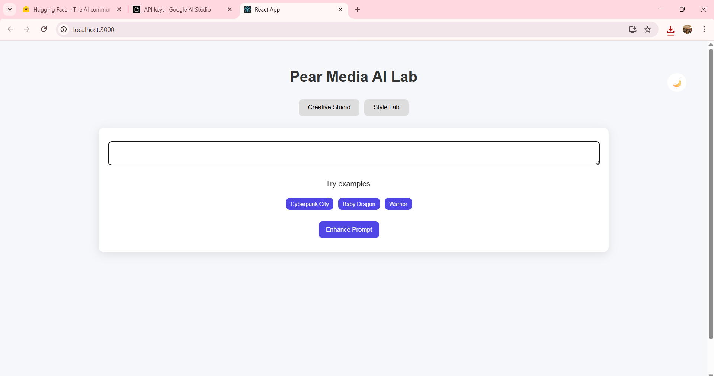

# 🚀 Pear Media AI Lab

An AI-powered web application that combines **text generation** and **image synthesis** to create a seamless creative experience using modern generative AI models.

---

## 📌 Project Overview

**Pear Media AI Lab** is designed to explore real-world AI workflows by integrating:

* ✍️ Prompt enhancement (LLM)
* 🖼️ Image understanding (Vision AI)
* 🎨 Image generation (Diffusion models)

It provides two main modules:

* **Creative Studio** – Transform ideas into enhanced prompts and generate images
* **Style Lab** – Upload an image, analyze it, and generate stylized variations

---

## ✨ Features

### 🎨 Creative Studio

* Enter a basic idea or prompt
* AI enhances the prompt using Gemini
* Generate high-quality images from enhanced prompts
* Example prompts for quick testing
* Download generated images

---

### 🖼️ Style Lab

* Upload an image from local system
* Preview uploaded image
* AI analyzes:

  * Main objects
  * Color palette
  * Artistic style
* Add custom instructions (e.g., *“make it Pixar style”*)
* Generate AI-based variations
* Download generated images

---

## 🧠 Project Flow

### 🔹 Text Workflow

1. User enters prompt
2. Gemini enhances the prompt
3. Enhanced prompt → Image generation API
4. Image displayed + download option

---

### 🔹 Image Workflow

1. User uploads image
2. FileReader converts image → Base64
3. Base64 sent to Gemini Vision model
4. AI extracts:

   * Objects
   * Colors
   * Style
5. User adds custom instructions
6. Final prompt constructed
7. Stable Diffusion generates new image
8. Output displayed + download option

---

## 🔌 API Usage

### 🔹 Google Gemini API

Used for:

* Prompt enhancement
* Image analysis (Vision)

**Endpoint:**

```id="c7q0w1"
https://generativelanguage.googleapis.com/v1/models/gemini-2.5-flash:generateContent
```

---

### 🔹 Hugging Face API

Used for:

* Image generation (Stable Diffusion)

**Endpoint:**

```id="9e4y2b"
https://router.huggingface.co/models/runwayml/stable-diffusion-v1-5
```

---

## 🛠️ Tech Stack

### Frontend

* React.js
* CSS (Custom Styling)

### Backend

* Node.js
* Express.js

### AI Models

* Gemini 2.5 Flash (Text + Vision)
* Stable Diffusion (Image Generation)

---

## ⚙️ Installation & Setup

### 1. Clone Repository

```bash id="k2m9x4"
git clone https://github.com/Jayakesharwani/pearmedia-ai
cd pearmedia-ai
```

---

### 2. Install Dependencies

#### Frontend

```bash id="v8d1p3"
npm install
```

#### Backend

```bash id="t5z7n6"
cd backend
npm install
```

---

### 3. Environment Variables

Create `.env` file inside **backend folder**:

```env id="q3r8l2"
REACT_APP_GEMINI_KEY=your_gemini_api_key
HF_TOKEN=your_huggingface_token
```

---

### 4. Run the Project

#### Start Backend

```bash id="n6x2p5"
cd backend
node server.js
```

#### Start Frontend

```bash id="f4y9d8"
cd frontend
npm start
```

---

## 📸 Screenshots

> Add your screenshots in a `/screenshots` folder and link them below.

### 🏠 Home Page



### 🎨 Creative Studio


### 🖼️ Style Lab


### 🌙 Dark Mode


---

## 🚀 Key Highlights

* Combines **AI automation + user control**
* Implements **human-in-the-loop prompting**
* Handles image processing using **Base64 encoding**
* Clean UI with:

  * Dark mode 🌙
  * Example prompts
  * Loading animation
* Real-world AI pipeline simulation

---

## 💡 Future Improvements

* Image history gallery
* Multiple style presets
* Drag-and-drop upload
* Share/shareable links
* Better prompt templates

---

## 👨‍💻 Author

Developed as part of the **Pear Media AI Lab Assignment**.

---

## 📄 License

This project is for educational and demonstration purposes only.
