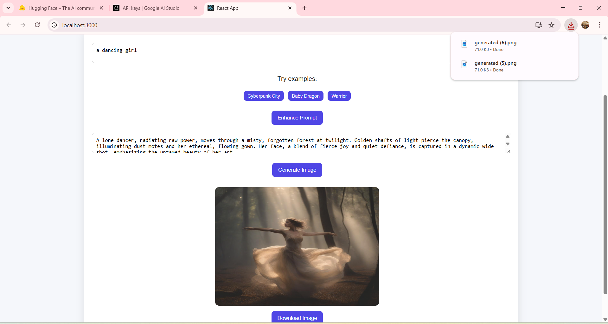
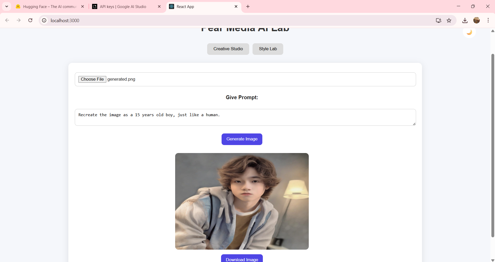
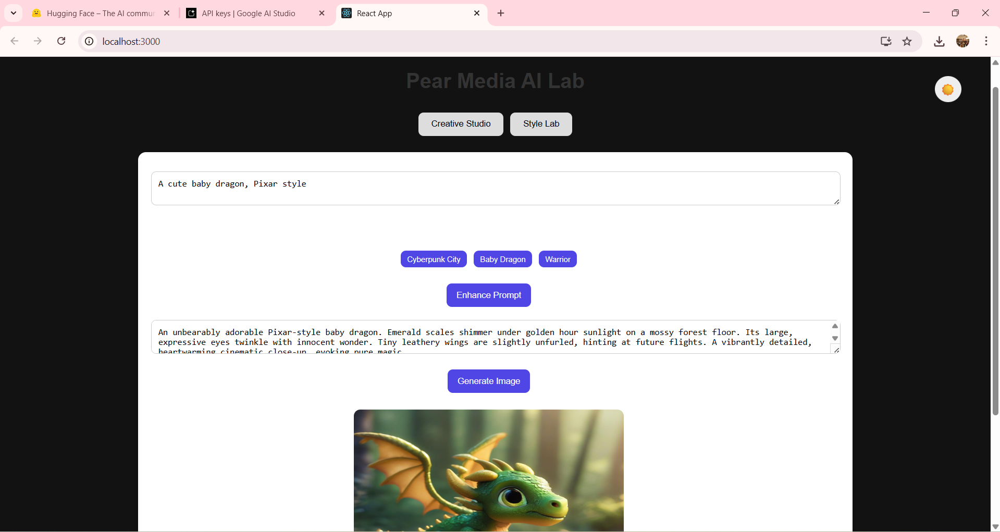

# 🚀 Pear Media AI Lab

An AI-powered web application that combines **text generation** and **image synthesis** to create a seamless creative experience using modern generative AI models. The project integrates computer vision, prompt engineering, and image generation into a seamless workflow.

---

## 📌 Project Overview

**Pear Media AI Lab** is designed to explore real-world AI workflows by integrating:

* ✍️ Prompt enhancement (LLM)
* 🖼️ Image understanding (Vision AI)
* 🎨 Image generation (Diffusion models)

It provides two main modules:

* **Creative Studio** – Transform ideas into enhanced prompts and generate images with summaries
* **Style Lab** – Upload an image, analyze it, and generate stylized variations with summerizations

---

## ✨ Features

### 🎨 Creative Studio

* Enter a basic idea or prompt
* AI enhances the prompt using Gemini
* Generate high-quality images from enhanced prompts with summaries
* Example prompts for quick testing
* Download generated images

---

### 🖼️ Style Lab

* Upload an image from local system
* AI analyzes:
  * Main objects
  * Color palette
  * Artistic style  
* A quick summarization generated from the analyzed points 
* Add custom instructions (e.g., *“make it Pixar-style”*)
* Generate AI-based variations with summaries
* Download generated images

---

## 🧠 Project Flow

### 🔹 Text Workflow

User Prompt 
   ↓
Gemini Prompt Enhancement (Cinematic Prompt) 
   ↓
Enhanced Prompt 
   ↓
Stable Diffusion XL (Image Generation) 
   ↓
Generated Image 
   ↓
+ AI Summary 
   ↓
Download Option

---

### 🔹 Image Workflow

Image Upload 
   ↓
Base64 Conversion 
   ↓
Gemini Vision Analysis (Objects + Style + Colors) 
   ↓
Concise AI Summary 
   ↓
+ User Instructions 
   ↓
Final Prompt Construction 
   ↓
Stable Diffusion XL (Image Generation) 
   ↓
Generated Image Output 
   ↓
+ AI Summary (Post-generation) 
   ↓
Download Option

---

## 🔌 API Usage

### 🔹 Google Gemini (Hybrid Usage)

✅ Backend (Google GenAI SDK)

Used for:

* Image analysis (Vision)
* Summary generation


✅ Frontend (REST API)

Used for:

* Prompt enhancement

**Endpoint:**

```id="c7q0w1"
https://generativelanguage.googleapis.com/v1beta/models/gemini-2.5-flash:generateContent
```

---

### 🔹 Hugging Face API

Used for:

* Image generation (Stable Diffusion XL)

**Endpoint:**

```id="9e4y2b"
https://router.huggingface.co/hf-inference/models/stabilityai/stable-diffusion-xl-base-1.0
```

---

## 🛠️ Tech Stack

### Frontend

* React.js
* CSS (Custom Styling)

### Backend

* Node.js
* Express.js

### AI Models

* Gemini 2.5 Flash (Text + Vision)
* Stable Diffusion XL (via Hugging Face for Image Generation)

---

## 📁 Project Structure

```bash
pearmedia-ai/
│
├── public/                           # Static assets
│   ├── index.html
│
├── src/                              # React frontend
│   ├── components/                   # UI components
│   │   ├── WorkflowImage.js
│   │   ├── WorkflowText.js
│   │   ├── index.css                 # Component styles
│   │
│   ├── utils/                        # API helper functions
│   │   ├── apiHelpers.js
│   │
│   ├── App.js                        # Main app component
│   ├── App.css                       # Global styles
│   ├── index.js                      # Entry point
│
├── backend/                          # Node.js backend
│   ├── server.js                     # Express server & routes
│   ├── .env                          # Backend environment variables
│   ├── package.json
│
├── .env                              # Frontend environment variables
├── package.json                      # Root config
├── README.md
``` 

--- 


## ⚙️ Installation & Setup

### 1. Clone Repository

```bash id="k2m9x4"
git clone https://github.com/Jayakesharwani/pearmedia-ai
cd pearmedia-ai
```

---

### 2. Install Dependencies

#### Frontend

```bash id="v8d1p3"
npm install
```

#### Backend

```bash id="t5z7n6"
cd backend
npm install
```

---

### 3. Environment Variables

Create `.env` file inside **backend folder**:

```env id="q3r8l2"
REACT_APP_GEMINI_KEY=your_gemini_api_key
HF_TOKEN=your_huggingface_token
```
Create `.env` file inside root folder **pearmedia-ai** for frontend:

```env id="q3r8l2"
REACT_APP_GEMINI_KEY=your_gemini_api_key
```

---

### 4. Run the Project

#### Start Backend

```bash id="n6x2p5"
cd backend
node server.js
```

#### Start Frontend

```bash id="f4y9d8"
npm start
```

---

## 📸 Screenshots

> Add your screenshots in a `/screenshots` folder and link them below.

### 🏠 Home Page


### 🎨 Creative Studio



### 🖼️ Style Lab



### 🌙 Dark Mode



--- 

## ⚠️ Important Notes 

* Gemini API has daily request limits (free tier)
* Hugging Face has monthly usage credits
* Restart backend after updating .env
* Large image inputs may increase response time significantly

---

## 🚀 Key Highlights

* Combines **AI automation + user control**
* Implements **human-in-the-loop prompting**
* Handles image processing using **Base64 encoding**
* Clean UI with:
  * Dark mode 🌙
  * Example prompts
  * Image Download Functionality
  * Loading animation
* Real-world AI pipeline simulation

---

## 💡 Future Enhancements

* Image history gallery
* Multiple style presets
* Drag-and-drop upload
* Share/shareable links
* Better prompt templates

---

## 👨‍💻 Author

Developed as part of the **Pear Media AI Lab Assignment**.

---

## 📄 License

This project is created as part of an assignment submission for **Pear Media**. 
It is not intended for public reuse or distribution.
